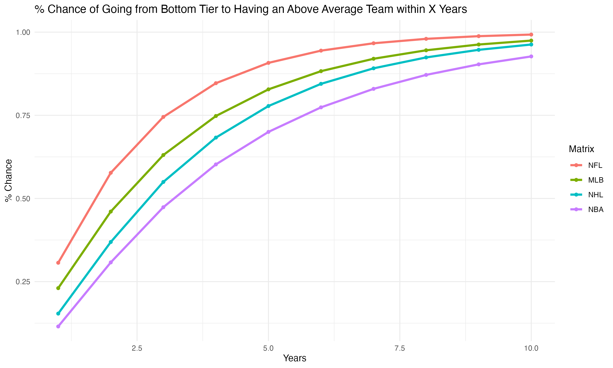

# sports-parity
Which sports leagues have the most parity? 

I worked with Daniel Rashes to try and answer this question. We used Markov Chains and bucketed season-by-season results.

I go into the project in much more detail at: https://www.ryderfried.com/projects

Here is a graph that overviews results.

